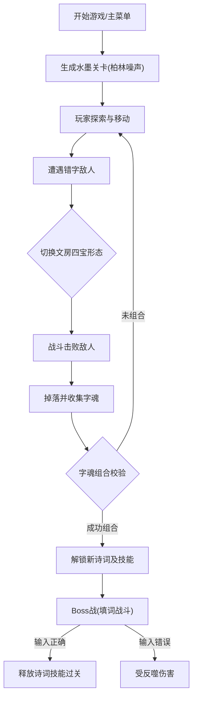

## 1. 产品概述
《墨语行者》是一款基于“机制驱动的内容复用”理念设计的极简独立游戏Web版原型。
- 主要目的在于用极小的体积承载深厚的中华诗词文化，通过1-bit水墨像素风格和填诗战斗机制，让玩家在娱乐中自然学习经典诗词。
- 核心受众为喜欢复古像素风、Roguelike元素、以及中华传统文化和诗词的玩家。其市场价值在于探索极限体积下的创意边界与“游戏化学习”的优雅结合。

## 2. 核心功能

### 2.1 用户角色
| 角色 | 注册方式 | 核心权限 |
|------|----------|----------|
| 玩家 | 本地免注册 | 体验完整的游戏流程、战斗、解锁诗词 |

### 2.2 功能模块
1. **主菜单界面**：开始游戏、选项（键位、难度配置）、诗词库查看、制作组信息。
2. **战斗/探索场景**：瓦片地图渲染、角色移动与攻击、文房四宝形态切换、敌人AI与生成。
3. **填诗战斗系统**：实时汉字输入、字魂收集、诗词匹配与技能释放。
4. **成长与组合树界面**：展示已收集的字魂、解锁的诗词片段、以及当前的组合状态。

### 2.3 页面详情
| 页面名称 | 模块名称 | 功能描述 |
|----------|----------|----------|
| 主菜单 | 导航区 | 提供开始、选项、诗词库入口。播放《广陵散》改编8-bit音乐 |
| 游戏主场景 | 渲染区 | 渲染1-bit水墨风格的地图和角色。处理角色四种形态的切换逻辑 |
| 游戏主场景 | 战斗UI | 显示血量、文气值。触发填诗时，弹出半透明填空UI框，处理玩家输入 |
| 成长系统页 | 技能树 | 树状结构展示字魂组合，点击可查看已解锁的诗词背景及效果 |

## 3. 核心流程
玩家探索程序生成的水墨关卡，通过击败错字敌人收集字魂，组合字魂解锁诗词，并在战斗中通过正确填词释放强力技能，最终击败文魔。

## 4. 用户界面设计
### 4.1 设计风格
- 主次颜色：极简黑白双色（1-bit像素风格），利用抖动算法模拟水墨灰度渐变。
- 按钮风格：复古像素框，无圆角，高对比度，选中时反色（白底黑字）。
- 字体及大小：自定义点阵中文字体风格，清晰可读的像素风。
- 布局风格：极简留白，UI元素靠边缘分布，突出中间的“水墨画卷”场景。
- 图标风格：16x16像素点阵图标，抽象极简。

### 4.2 页面设计概述
| 页面名称 | 模块名称 | UI元素 |
|----------|----------|--------|
| 主界面 | 标题与菜单 | 动态水墨背景，闪烁的“按任意键开始”文本，像素风Logo |
| 游戏主场景 | 状态栏 | 顶部显示生命值（墨滴图标）、文气值条，当前四宝形态图标 |
| 填诗UI | 交互框 | 底部弹出带扫描线效果的黑底白字框，显示带下划线的诗句和候选项 |

### 4.3 响应式设计
优先适配桌面端（PC键盘操作），Web版需支持浏览器窗口自适应缩放（保持像素完美比例的整数倍放大）。
