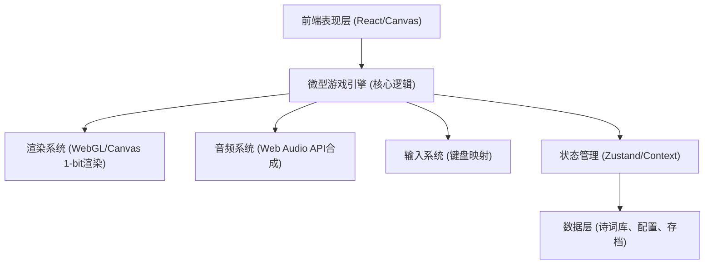
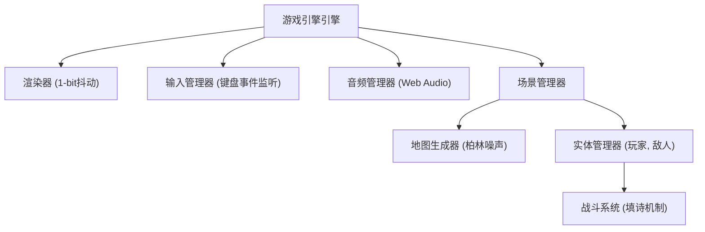
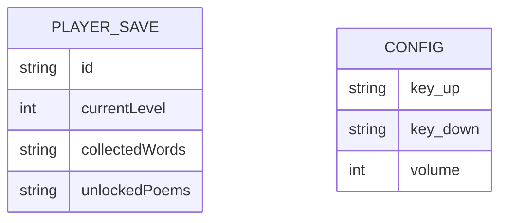

## 1. 架构设计


## 2. 技术说明
- **前端框架**: React@18 + tailwindcss@3 + vite
- **渲染引擎**: 原生 HTML5 Canvas 2D 或 WebGL（基于1-bit水墨像素风格的自定义微型渲染管线，使用柏林噪声生成地图）。
- **音频系统**: 基于 Web Audio API 的程序化音效合成（方波、噪声等），以及对背景音乐的调度。
- **状态管理**: Zustand 或 React Context，用于管理血量、文气、当前字魂和形态等。
- **初始化工具**: vite-init

## 3. 路由定义
| 路由 | 用途 |
|------|------|
| / | 游戏主菜单与加载页 |
| /game | 核心游戏场景与战斗流程 |
| /collection | 诗词图鉴与字魂组合树 |

## 4. API 定义 (本地数据结构)
由于是纯本地游戏，使用以下 TypeScript 接口管理核心状态：
```typescript
interface PlayerState {
  hp: number;
  maxHp: number;
  wenqi: number; // 文气值
  form: 'brush' | 'ink' | 'paper' | 'stone'; // 笔、墨、纸、砚
  collectedWords: string[]; // 已收集的字魂
  unlockedPoems: string[]; // 已解锁的完整诗词ID
}

interface Poem {
  id: string;
  content: string; // 完整诗句，如 "生当作人杰，死亦为鬼雄"
  missingPart: string; // 需填空的部分
  options: string[]; // 候选项
  correctIndex: number;
  effectType: 'heal' | 'summon' | 'damage' | 'terrain';
}
```

## 5. 核心模块类图


## 6. 数据模型 (本地存储)
### 6.1 数据模型定义

### 6.2 数据定义语言
采用 `localStorage` 进行数据持久化存储，无需真实的SQL数据库。初始化数据（预置的500首诗词和哈夫曼压缩表）可直接以静态 JSON 文件或 TypeScript 字典的形式打包，在客户端加载后解压至内存。
